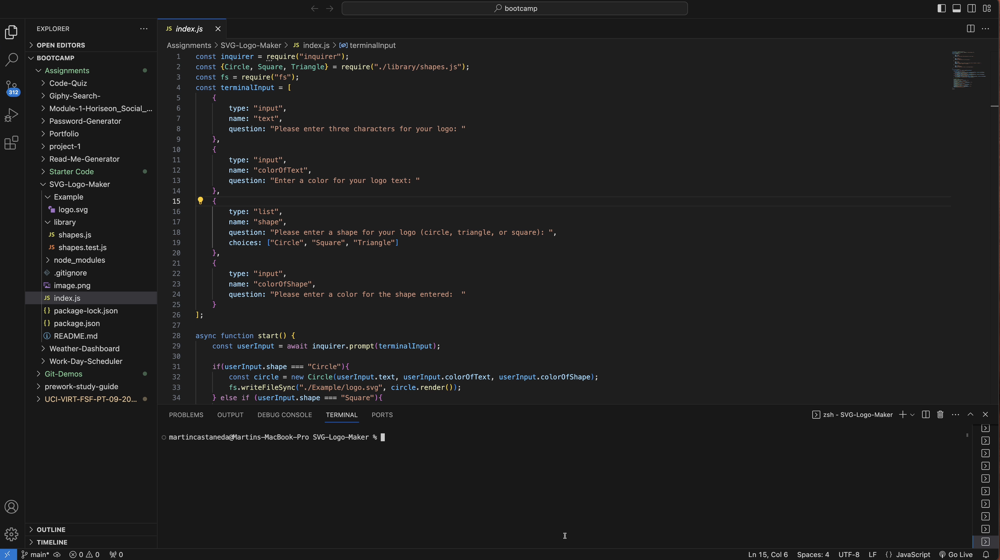
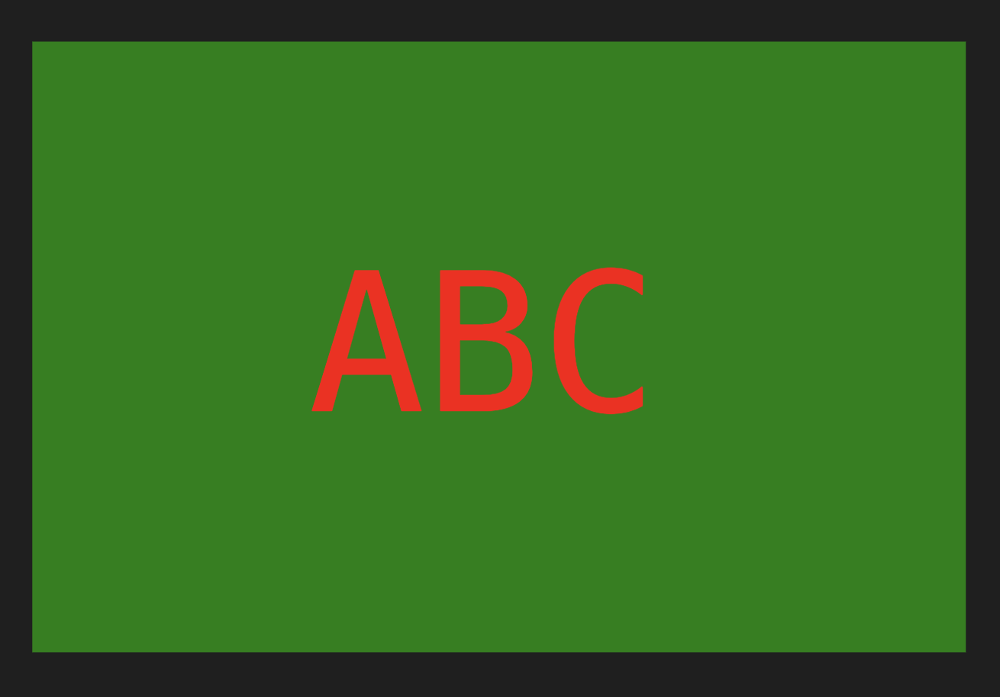

# SVG-Logo-Maker

## Demonstration Video 
 

https://drive.google.com/file/d/1tSjX9J6Zh--uWhphxKStZDB9huTyV2eq/view?usp=share_link 

* Please note, 'npm install' was ran before screen recording commenced 
* Test run at the end includes to check for all three shapes which is why one shows as passed and others show as failed

## User Story

* AS a freelance web developer
* I WANT to generate a simple logo for my projects
* SO THAT I don't have to pay a graphic designer

## Acceptance Criteria

* GIVEN a command-line application that accepts user input
* WHEN I am prompted for text
* THEN I can enter up to three characters
* WHEN I am prompted for the text color
* THEN I can enter a color keyword (OR a hexadecimal number)
* WHEN I am prompted for a shape
* THEN I am presented with a list of shapes to choose from: circle, triangle, and square
* WHEN I am prompted for the shape's color
* THEN I can enter a color keyword (OR a hexadecimal number)
* WHEN I have entered input for all the prompts
* THEN an SVG file is created named `logo.svg`
AND the output text "Generated logo.svg" is printed in the command line
* WHEN I open the `logo.svg` file in a browser
* THEN I am shown a 300x200 pixel image that matches the criteria I entered

## SVG Logo Example 

## Resources
Philip Loy (Academic Tutor)
https://www.testim.io/blog/node-js-unit-testing-get-started-quickly-with-examples/ 